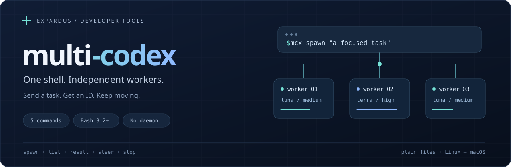
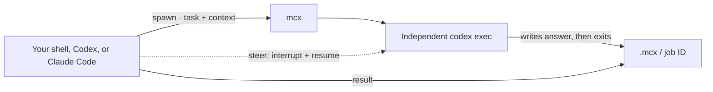

<p align="center">
  
</p>

<p align="center">
  <a href="https://github.com/exPardus/multi-codex/actions/workflows/test.yml"></a>
  
  
  
</p>

<p align="center">
  <strong>Give Codex and Claude Code independent Codex workers through the shell.</strong><br>
  One Bash executable. Five commands. Plain files. No daemon.
</p>

<p align="center">
  <a href="#quickstart">Quickstart</a> ·
  <a href="#five-commands">Commands</a> ·
  <a href="#choose-your-worker-model">Models</a> ·
  <a href="#codex-knows-its-role">Startup context</a> ·
  <a href="CONTRIBUTING.md">Contributing</a>
</p>

---

## Why multi-codex?

A coordinating Codex or Claude Code session can hand off a focused task, keep working, and collect
an answer later. Each worker is an independent `codex exec` process, outside the
coordinator's native subagent pool. Workers start fresh and exit when finished.

The helper stays small enough to inspect in one sitting. There is no scheduler,
service, database, or framework to operate. Account usage and rate limits still
apply.

| Small by design | What you get |
| --- | --- |
| **Fire and forget** | `spawn` returns a worker ID immediately; the worker survives the launching shell closing. |
| **Explicit context** | Pass the task and everything the worker needs. No parent transcript is copied. |
| **Cost-conscious defaults** | Workers use **Luna / medium**, with explicit model and reasoning overrides. |
| **Controlled delegation** | Workers may use native Codex subagents; workers and their subagents cannot launch more workers through `mcx`. |
| **Inspectable state** | Prompts, status, logs, and answers are files in `.mcx/`. |

## Quickstart

You need **Bash 3.2+**, an installed and authenticated **Codex CLI**, and standard
Unix utilities. Python 3 is used only for installation and tests. The current
integration was verified with Codex CLI **0.153.4** and Claude Code **2.1.267**.

```sh
git clone https://github.com/exPardus/multi-codex.git
cd multi-codex
python3 install.py both

# From any project directory:
cd /path/to/your/project
id=$(mcx spawn "Review src/auth for bugs. Report findings; do not edit files.")
mcx list
mcx result "$id"
```

The installer links **`mcx`** and **`multicodex`** into `~/.local/bin` and installs
the native plugin for both apps using their own plugin CLIs. Both command names
run the same Bash program. Choose just what you need:

| Install | Command |
| --- | --- |
| Both apps + PATH commands | `python3 install.py both` |
| Codex + PATH commands | `python3 install.py codex` |
| Claude Code + PATH commands | `python3 install.py claude` |
| PATH commands only | `python3 install.py cli` |

If the bin directory is not on PATH, add this to your shell configuration:

```sh
export PATH="$HOME/.local/bin:$PATH"
```

In Codex, open `/hooks` and trust **Loading multi-codex context** once. Start a new
session in each app to load the skill and startup context. Invoke **`$mcx`** in
Codex or **`/multi-codex:mcx`** in Claude Code, or simply ask for background Codex
workers. Claude Code uses your existing Codex login to run the workers.

> **Keep the checkout.** PATH commands are symlinks to it. Use
> `MCX_BIN_DIR=/your/bin python3 install.py both` for a different bin directory.
> Existing unrelated commands are never overwritten. `install-codex.py` remains
> an alias for the Codex installer.

### Install through plugin marketplaces

The public repository is a marketplace for both apps. You can install the plugin
without the Python installer:

```sh
# Codex
codex plugin marketplace add exPardus/multi-codex
codex plugin add multi-codex@multi-codex

# Claude Code
claude plugin marketplace add exPardus/multi-codex
claude plugin install multi-codex@multi-codex --scope user
```

The plugin bundles the executable, skill, and startup hook. Its hook supplies an
absolute launcher path when `mcx` is absent from PATH. For the short shell command
everywhere, clone the repo and run `python3 install.py cli`. A standalone skill is
also available at [`plugins/multi-codex/skills/mcx`](plugins/multi-codex/skills/mcx);
the plugin is the complete installation, including automatic startup context.

## Five commands

| Command | What it does |
| --- | --- |
| `mcx spawn "task"` | Starts a fresh background worker and prints its ID. |
| `mcx list` | Shows local worker IDs, states, models, effort, and tasks. |
| `mcx result ID` | Prints a finished worker's final answer. |
| `mcx steer ID "new instruction"` | Interrupts the current run and resumes that worker's saved conversation. |
| `mcx stop ID` | Stops the worker's process group; completed jobs are left alone. |

Pass `-` to read a prompt from stdin. This works for both `spawn` and `steer`:

```sh
mcx spawn - < task.md
mcx steer "$id" - < correction.md
```

### A small parallel workflow

Assign separate files or independent review tasks when workers share a workspace.
These are ordinary shell commands either coordinating assistant can run:

```sh
auth=$(mcx spawn "Review src/auth. Return concrete bugs and locations; do not edit.")
api=$(mcx spawn "Review src/api. Return concrete bugs and locations; do not edit.")

# Continue your own work, then inspect completion.
mcx list
mcx result "$auth"
mcx result "$api"

# Follow up in the same worker conversation, even after it finishes.
mcx steer "$auth" "Check whether refresh token expiry changes your findings."
```

`result` exits with **0** when an answer is available, **2** while work is running,
and **1** for a failed, stopped, lost, or invalid job. Errors point to the logs.

Steering starts a new process in the same conversation; it is not live message
injection. The model and reasoning settings stay the same. If the initial session
ID is not available yet, retry shortly. A steer replaces that run's local logs
and answer; Codex retains its conversation history.

## Choose your worker model

The worker default is explicitly **`gpt-5.6-luna` / `medium`**, including when the
coordinator uses Astra. Native subagents default to their worker's saved model and
reasoning effort as well. There is no automatic escalation to a larger model.

```sh
# Give a more demanding task a stronger worker.
mcx spawn -m gpt-5.6-terra -r high "Fix the parser and run its tests."

# Or choose defaults for this shell.
export MCX_MODEL=gpt-5.6-terra
export MCX_EFFORT=medium
```

| Model | Suggested tasks |
| --- | --- |
| **Luna** · `gpt-5.6-luna` | Small, clearly defined tasks; the default. |
| **Terra** · `gpt-5.6-terra` | Everyday coding that needs more reasoning. |
| **Sol** · `gpt-5.6-sol` | Complex or open-ended work. |
| **Astra** · `gpt-6-astra` | Deliberate use when specifically requested. |

`-r` accepts `none`, `low`, `medium`, `high`, `xhigh`, or `max`; the chosen model
must support that setting. See the [Codex model guide](https://learn.chatgpt.com/docs/models?surface=cli)
for model capabilities and availability.

## Codex knows its role

The plugin’s `SessionStart` hook adds a short, role-specific instruction in both apps:

| Session | Startup context |
| --- | --- |
| **Coordinator** | How to call `mcx`, provide complete task context, collect results, and choose an appropriate model. |
| **Worker** | Complete the assigned task, using native Codex subagents if useful. Collect their results, close them, and finish. Do not launch independent workers. |

The hook runs at session start, including resume, clear, compaction, and Claude forks. Worker rules are also
included in every worker input, so they remain present without the plugin hook.
`MCX_WORKER=1` is exported and explicitly set in Codex's shell environment;
`spawn` and `steer` reject calls from workers and their subagents. Native Codex
subagents are enabled, with the normal Codex session limits. The worker's role
instructions also forbid independent sessions through direct Codex/Claude CLI calls.

This prevents accidental recursive worker spawning. It is not a security boundary
against deliberately changing the environment. Codex still loads its normal
configuration and project instructions, including `AGENTS.md`.

<details>
<summary><strong>Hook installation, updates, and removal</strong></summary>

Both manifests share `hooks/hooks.json` and one `mcx` skill. The startup hook emits
only role, discovery, and model essentials; detailed instructions load when the
skill is used. See [context design and official sources](docs/context-design.md).

Codex requires trusting the specific hook definition through `/hooks`. The
installer migrates the earlier global hook after successful plugin installation,
preserving unrelated hooks and backing up changes as `hooks.json.mcx-backup`.
It honors `CODEX_HOME`, and Claude Code honors `CLAUDE_CONFIG_DIR` through its CLI.

For checkout installations, `git pull` updates PATH commands immediately. Reinstall
Codex with `codex plugin add multi-codex@multi-codex` and refresh Claude Code with
`claude plugin update multi-codex@multi-codex` after a release. For GitHub marketplace
installations, update the marketplace snapshot first:

```sh
codex plugin marketplace upgrade multi-codex
codex plugin add multi-codex@multi-codex
claude plugin marketplace update multi-codex
claude plugin update multi-codex@multi-codex
```

Restart sessions after plugin updates and review any changed Codex hook. For local
plugin development, see [Contributing](CONTRIBUTING.md).

To uninstall plugins:

```sh
codex plugin remove multi-codex@multi-codex
claude plugin uninstall multi-codex@multi-codex
```

Remove your `mcx` and `multicodex` symlinks separately if you also want to remove
the PATH commands. Job files stay in each project’s `.mcx/` until you delete them.

</details>

## How it works



A short-lived wrapper records the Codex process's exit state. `nohup`, redirected
file descriptors, and a separate process group let the worker run independently
of its caller. `stop` sends TERM to that group and uses KILL after roughly three
seconds if needed.

Workers edit the caller's current directory with `workspace-write` permissions
and approval policy `never`. The launching environment must permit running Codex.
There is no automatic retry, worktree creation, or file merge handling.

### Plain files, easy inspection

```text
.mcx/
└── <worker-id>/
    ├── prompt          Instructions for the current run
    ├── model, effort   Saved model selection
    ├── pid, state      Process identity and lifecycle state
    ├── events.jsonl    Codex's event stream
    ├── log             Diagnostics
    └── result          Final answer
```

Run commands from the same project directory, or set **`MCX_DIR`** to an absolute
path to share one job folder across projects. Delete finished job folders when
you no longer need their results. Keep `.mcx/` out of your project's Git history.

| Environment variable | Purpose | Default |
| --- | --- | --- |
| `MCX_MODEL` | Model for new workers | `gpt-5.6-luna` |
| `MCX_EFFORT` | Reasoning effort for new workers | `medium` |
| `MCX_DIR` | Job storage directory | `.mcx/` in the current directory |
| `CODEX_BIN` | Codex executable or wrapper | `codex` from PATH |
| `MCX_BIN_DIR` | Installer's command directory | `~/.local/bin` |

## Development

```sh
bash -n mcx
shellcheck mcx
python3 -m unittest discover -s tests -v
```

The offline tests exercise real process lifecycles using a fake Codex, plus
installation and hook preservation. CI runs on **Linux and macOS** with no
credentials or model calls. Real Codex smoke checks have also covered spawning,
steering, startup context in both apps, and recursion prevention.

Read [CONTRIBUTING.md](CONTRIBUTING.md) for the project conventions and
[CHANGELOG.md](CHANGELOG.md) for changes.

---

<p align="center">
  Built by <a href="https://github.com/exPardus">exPardus</a> around
  <a href="https://learn.chatgpt.com/docs/non-interactive-mode">Codex's non-interactive CLI</a>.
</p>
